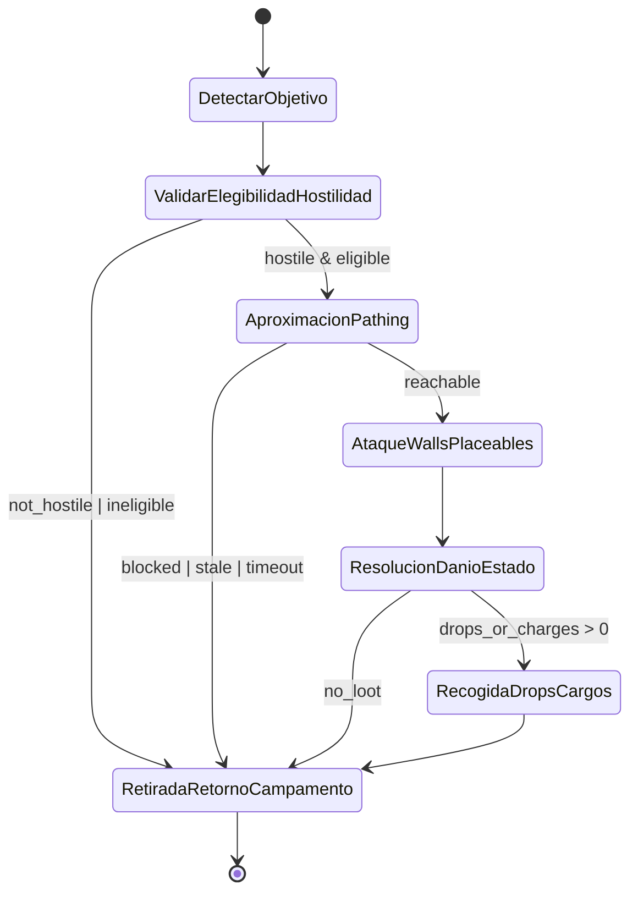

# Phase 7 · Cut 2 — Bandit Assault Mainline Contract

## Objetivo
Definir una única ruta principal (mainline) para el asalto de bandidos y formalizar ownership por etapa, contratos de handoff y transiciones válidas.

## Secuencia obligatoria (ruta principal)
La ejecución de un asalto **debe** seguir exactamente este orden:

1. **detectar objetivo**
2. **validar elegibilidad/hostilidad**
3. **aproximación/pathing**
4. **ataque a walls/placeables**
5. **resolución de daño/estado**
6. **recogida de drops/cargos**
7. **retirada y retorno al campamento**

> Política: no se permite saltar etapas ni reordenarlas fuera de las transiciones definidas en este documento.

---

## Ownership por etapa (decisión vs ejecución)

| # | Etapa | Owner de decisión | Owner de ejecución |
|---|---|---|---|
| 1 | detectar objetivo | `BanditAssaultDirector` | `TargetScanner` |
| 2 | validar elegibilidad/hostilidad | `BanditAssaultDirector` | `HostilityValidator` |
| 3 | aproximación/pathing | `BanditAssaultDirector` | `BanditNavigator` |
| 4 | ataque a walls/placeables | `BanditAssaultDirector` | `BanditAssaultExecutor` |
| 5 | resolución de daño/estado | `CombatResolutionSystem` | `DamageResolver` |
| 6 | recogida de drops/cargos | `LootPolicyService` | `DropCollector` |
| 7 | retirada y retorno al campamento | `BanditAssaultDirector` | `RetreatNavigator` |

### Regla de ownership
- **Decisión**: autoriza transición de etapa, retries y condiciones de salida.
- **Ejecución**: realiza acciones mecánicas, emite resultado y métricas.
- Ningún owner de ejecución puede auto-promoverse a la siguiente etapa sin un handoff válido.

---

## Contratos de handoff entre etapas

### 1 → 2: detectar objetivo → validar elegibilidad/hostilidad
**Entrega requerida**
- `target_id`
- `target_type` (`wall` | `placeable` | `actor`)
- `last_known_position`
- `detection_reason`

**Criterio de aceptación**
- `target_id` no nulo.
- `last_known_position` dentro de rango sensado.

### 2 → 3: validar elegibilidad/hostilidad → aproximación/pathing
**Entrega requerida**
- `target_id`
- `hostility_verdict` (`hostile` | `not_hostile`)
- `eligibility_verdict` (`eligible` | `ineligible`)
- `rejection_reason` (si aplica)

**Criterio de aceptación**
- Solo avanza si `hostility_verdict=hostile` y `eligibility_verdict=eligible`.

### 3 → 4: aproximación/pathing → ataque a walls/placeables
**Entrega requerida**
- `target_id`
- `path_status` (`reachable` | `blocked` | `stale`)
- `arrival_distance`
- `approach_timeout_ms`

**Criterio de aceptación**
- Solo avanza si `path_status=reachable` y `arrival_distance <= attack_range`.

### 4 → 5: ataque a walls/placeables → resolución de daño/estado
**Entrega requerida**
- `attack_event_id`
- `target_id`
- `attack_profile`
- `impact_timestamp`

**Criterio de aceptación**
- `attack_event_id` único y timestamp válido.

### 5 → 6: resolución de daño/estado → recogida de drops/cargos
**Entrega requerida**
- `resolution_id`
- `target_state_after` (`alive` | `destroyed` | `disabled`)
- `generated_drops[]`
- `generated_charges[]`

**Criterio de aceptación**
- Solo avanza si existe al menos un elemento en `generated_drops` o `generated_charges`.

### 6 → 7: recogida de drops/cargos → retirada y retorno al campamento
**Entrega requerida**
- `haul_manifest`
- `pickup_status` (`complete` | `partial` | `failed`)
- `carry_capacity_used`
- `retreat_reason`

**Criterio de aceptación**
- Siempre transiciona a retirada; `pickup_status` define severidad/telemetría.

---

## Prohibición de rutas alternativas silenciosas

Quedan **prohibidas** las rutas alternativas silenciosas fuera de la secuencia principal.

No permitido:
- Ejecutar ataque sin pasar por validación de elegibilidad/hostilidad.
- Saltar de aproximación directamente a recogida.
- Retirarse sin registrar handoff de cierre.
- Reintentar etapas por atajos implícitos sin evento explícito (`retry_declared`).

### Regla de cumplimiento
Cualquier desvío debe:
1. Emitir evento explícito (`mainline_violation_detected` o `declared_branch`).
2. Registrar `reason_code`.
3. Marcar el run como `non_mainline_compliant`.

---

## Diagrama simple de estados y transiciones permitidas

## Gate de PR obligatorio para Bandit Assault Pipeline

Todo PR que toque etapas, transiciones o contratos de handoff de este pipeline debe declarar explícitamente:

- etapa(s) afectada(s),
- owner(es) afectados (decisión y/o ejecución),
- evidencia de que no crea bifurcación fuera del diagrama canónico.

Checklist obligatoria de revisión:

- ¿introduce ruta alternativa?
- ¿duplica decisión ya definida?
- ¿corrige intención a mitad de pipeline?

### Regla de bloqueo de merge

Se bloquea el merge cuando:

1. el cambio crea una bifurcación no documentada en el diagrama canónico de este documento;
2. no declara etapa y owner afectados por cada cambio de pipeline;
3. introduce cualquiera de los tres casos de checklist sin mitigación/excepción aprobada.

### Excepciones temporales

Cuando una excepción temporal sea imprescindible:

- registrar en `docs/incidencias/registro-unico-deuda-tecnica.md`,
- incluir responsable,
- incluir fecha de retiro (`YYYY-MM-DD`),
- mantener revisión semanal hasta retiro efectivo.

## Criterio de aceptación del documento
- Existe una sola ruta principal obligatoria con orden explícito.
- Cada etapa define owner de decisión y owner de ejecución.
- Cada transición tiene contrato de handoff verificable.
- Se establece prohibición explícita de rutas alternativas silenciosas.
- Se incluye diagrama con estados y transiciones permitidas.

---

## Mapa de módulos con re-decisión detectada durante el recorrido

| Tipo de decisión | Owner canónico | Módulos observados en pipeline | Estado |
|---|---|---|---|
| targeting | `BanditBehaviorLayer.dispatch_group_to_target` | `BanditBehaviorLayer`, `BanditWorldBehavior._build_structure_assault_intent`, `BanditWorkCoordinator._handle_structure_assault_command`, `BanditWallAssaultPolicy.evaluate_structure_directive` | `DUP_DECISION_IN_PIPELINE` |
| engage | `BanditWallAssaultPolicy.evaluate_structure_directive` | `RaidFlow._tick_approaching` + `BanditWallAssaultPolicy` (doble gate de acercamiento) | `DUP_DECISION_IN_PIPELINE` |
| breach | `BanditWorkCoordinator._handle_structure_assault_command` (consume directiva) | `BanditWallAssaultPolicy` + `BanditWorkCoordinator` (validación + ejecución) | `CANONICAL_SINGLE_OWNER` |
| loot | `BanditWorkCoordinator._try_loot_nearby_container` | `BanditWorldBehavior` (gating), `BanditWorkCoordinator` (extracción) | `CANONICAL_SINGLE_OWNER` |
| retreat | `RaidFlow._finish_raid` / `BanditWorldBehavior.force_return_home` por evento explícito | `RaidFlow`, `BanditWorldBehavior.apply_execution_feedback` | `CANONICAL_SINGLE_OWNER` |

### Ajuste aplicado en este cut (anti re-decisión)

1. **Targeting canónico por etapa previa**
   - `BanditWorldBehavior` ahora entrega `canonical_target` + `consume_canonical_only=true` en el handoff de ejecución para asalto de estructura.
   - `BanditWorkCoordinator` pasa ese target canónico a `BanditWallAssaultPolicy`.
   - `BanditWallAssaultPolicy` consume primero `canonical_target`; cuando `consume_canonical_only=true`, no re-decide con búsquedas/fallbacks alternativos.

2. **Sin correcciones tardías “por si acaso”**
   - Se removió la corrección tardía que forzaba `return_home` cuando `no_attack_target` y había cargo, porque alteraba la ruta principal sin evento de transición declarado.
   - La retirada sigue permitida por eventos explícitos (`container_looted`, fin de raid, timeouts, etc.).
